# **Workshop Tutorial: Digitizing French Ports and Railroads in ArcGIS Online (Individual User)**

## **Introduction**

This tutorial will guide you through creating an **ArcGIS Online** application for digitizing **ports** and **railroads** using a historical map of French ports and railroads. The goal is to convert key features from the map into geospatial data. This version is designed for individual users working independently.

### **About the XYZ Tiles**

The map used for this digitization task is accessible as an **XYZ tile layer** via a **IIIF manifest**. This setup enables viewing and digitizing the historical map within ArcGIS Online.

#### **What are XYZ Tiles?**

**XYZ tiles** are a web standard for displaying maps on the internet. Instead of sending one giant image, maps are divided into small square tiles (typically 256×256 pixels) organized in a grid. Each tile is identified by three coordinates:

- **X** = horizontal position (column)
- **Y** = vertical position (row)
- **Z** = zoom level (how far in or out you are viewing)

For example, at zoom level 1, there are only 4 tiles (2×2 grid). At zoom level 10, there are over 1 million tiles! Your browser only loads the tiles you can see, making maps fast and responsive. This is why Google Maps, OpenStreetMap, and most web maps use this format.

#### **What is a IIIF Manifest?**

**IIIF** (International Image Interoperability Framework) is a standard that allows libraries, museums, and archives to share high-quality images online. A **IIIF manifest** is a structured file (in JSON format) that describes an image or collection of images, along with metadata. Tools like Allmaps.org can read this manifest and convert the historical map into XYZ tiles so you can use it in GIS applications.

#### **Relevant Links**

- **IIIF Manifest URL**:
  `https://purl.stanford.edu/zc368qw3281/iiif/manifest`
- **Viewer Link**:
  [Stanford Digital Repository Viewer](https://purl.stanford.edu/zc368qw3281)
  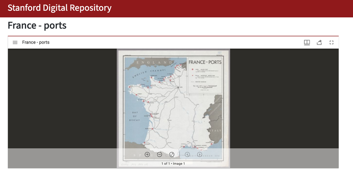
- **Allmaps Editor Link**:
  [View and edit the map georeferencing](https://editor.allmaps.org/results?url=https%3A%2F%2Fpurl.stanford.edu%2Fzc368qw3281%2Fiiif%2Fmanifest&image=https%3A%2F%2Fstacks.stanford.edu%2Fimage%2Fiiif%2Fzc368qw3281%252Fzc368qw3281_00_0001) for the map we are working with).
- **Allmaps Results Page**: `https://allmaps.xyz/maps/560151a07e32b2e1/{z}/{x}/{y}.png`

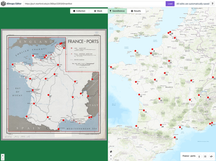
---------------------------------------------------------------------

## **Step 1: Login to ArcGIS Online**

1. Open a web browser and navigate to [Stanford's ArcGIS Online Org](https://stanford.maps.arcgis.com):  https://stanford.maps.arcgis.com
   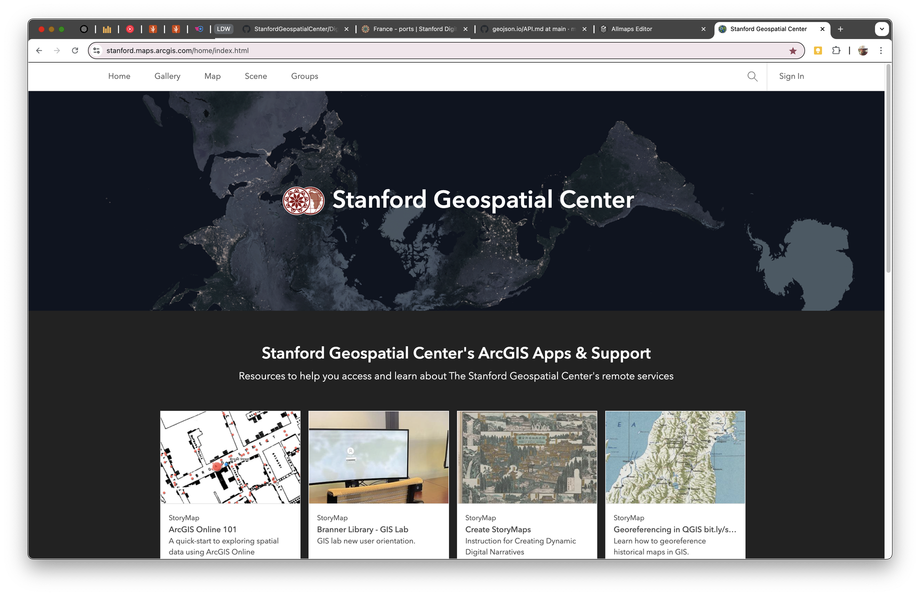
2. Click **Sign In**.

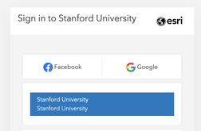

3. Click the blue **Stanford University** button
4. You should be redirected to Stanford's Single Sign-On (SSO) page. Use your Stanford SUNetID and password to log in.

---

## **Step 2: Create a New Feature Dataset**

#### **What is a Feature Layer?**

A **feature layer** is a dataset that stores geographic features (points, lines, or polygons) along with their attributes (data). For example, a point represents a port location with attributes like port name and type. Feature layers are the core of GIS—they're where your actual data lives. You'll create two feature types here: points for ports and lines for railroads.

1. Click **Content** in the top menu.
2. Select **New Item** → **Feature Layer** → **Define Your Own Layer**.

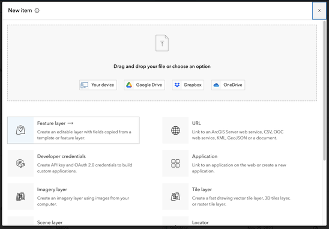

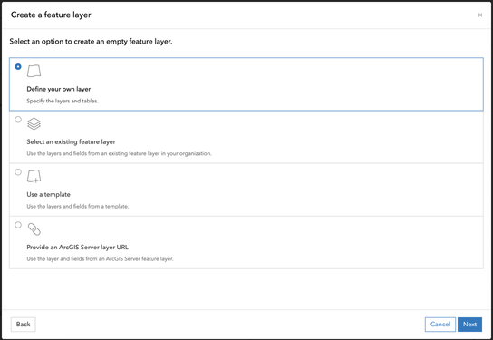

3. Under "Specify name and type" Add **Lines and Points** as the geometry type and name the layers `Ports` and `Railroads`

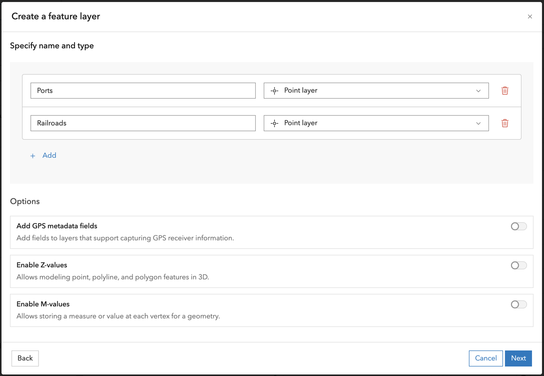

4. Click **Next**, and name the dataset **french_ports_railroads_[your initials or SUNetID]**

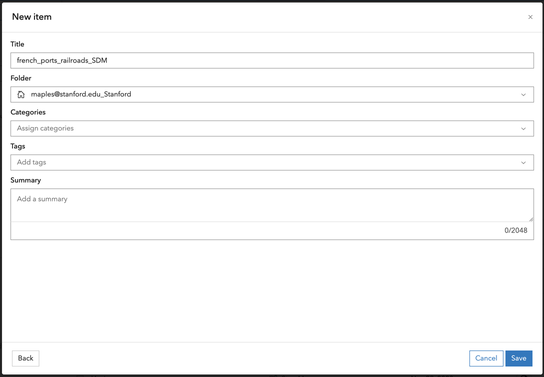

2. Click **Save**.

---

## **Step 3: Customize the Data Schema**

At this point, you should be redirected to the **Details Page** for the **french_ports_railroads_SUNetID** layer.

### **Adding Fields (Columns)**

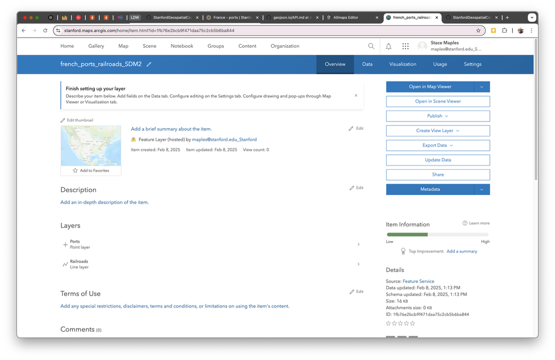

1. Click on **Data** at the top of the **Details Page**.
2. Confirm that `Layer:Ports` is selected in the **Layer** dropdown, and click on **Fields** to view the **Fields** panel.

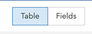
3. Click on the **+Add** Button and use the following image to fill the **Add Field** dialog.

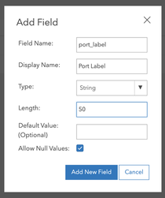

4. Repeat the previous step to add and define the following fields for the dataset (*note that you will change to the Railroads Layer and add it's new fields*):

| Field Name       | Data Type | Length | Description                                        |
| ------------------ | ----------- | -------- | ---------------------------------------------------- |
| `port_label`     | Text      | 50     | Name or identifier for the port.                   |
| `port_type`      | Text      | 50     | Classification of the port (major/minor).          |
| `railroad_label` | Text      | 50     | Name or identifier for the railroad.               |
| `notes`          | Text      | 255    | Additional observations or comments (both layers). |

---

## **Step 4: Create a Controlled Vocabulary List for a Field (Domain)**

#### **What is a Domain?**

A **domain** is a predefined list of acceptable values for a specific field in your database. For example, instead of allowing someone to type "BIG PORT," "big port," or "port-major" (three different spellings of the same thing), a domain forces them to select from a standardized list: **Major** or **Minor**. This ensures data **consistency** and **quality**—critical for any GIS project.

To standardize the input for `port_type`, create a domain with controlled vocabulary:

1. From the **Data > Fields** page in the feature layer Details for the `Ports` layer, click on the `port_type` field value to open its details page.
2. Click on **Create List** and create the following values:
   - **Major**
   - **Minor**

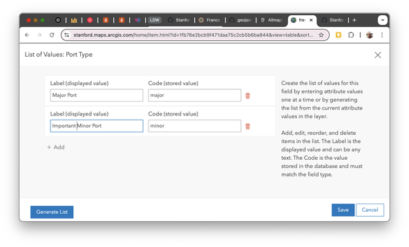
3. Click Save to assign this list (domain) to the `port_type` field.

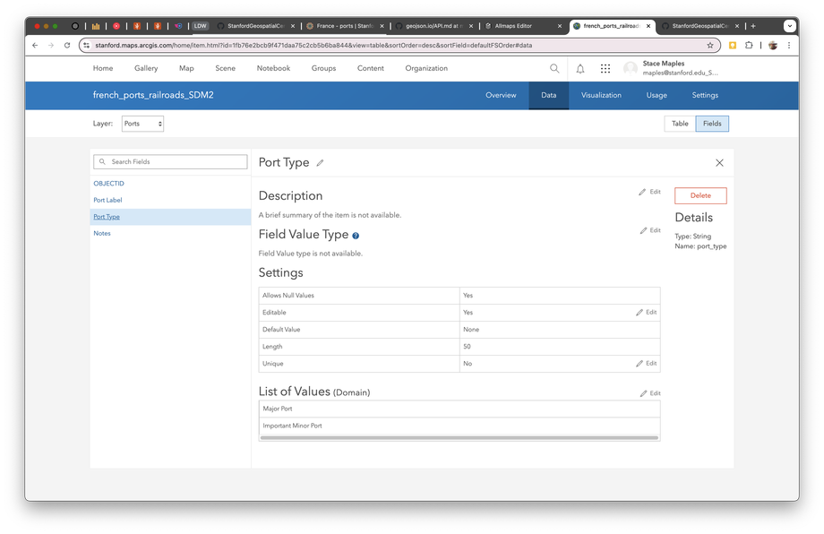

---

## **Step 5: Create a Map**

#### **What is a Map?**

In ArcGIS, a **map** is a visualization that combines multiple layers of data displayed together. Think of it like a stack of transparent sheets, each showing different information. Your map will have two layers: the XYZ tile layer (the historical map image) underneath, and your digitization data (ports and railroads) on top. Maps are the containers where data comes to life visually.

1. Click **Map** in the ArcGIS Online menu.
2. Click **Add** → **Add Layer from URL**.

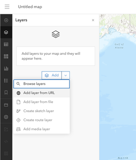

3. Paste the **XYZ tile URL** generated from the IIIF manifest (This can be found on the [**Results** page of the Allmaps Editor](https://editor.allmaps.org/results?url=https%3A%2F%2Fpurl.stanford.edu%2Fzc368qw3281%2Fiiif%2Fmanifest&image=https%3A%2F%2Fstacks.stanford.edu%2Fimage%2Fiiif%2Fzc368qw3281%252Fzc368qw3281_00_0001) for the map we are working with).
4. Alternatively, you can use this link: `https://allmaps.xyz/maps/560151a07e32b2e1/{z}/{x}/{y}.png`

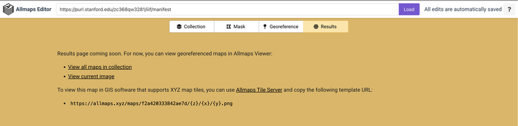

4. Confirm `Type: Tile Layer` is automatically detected after the paste.

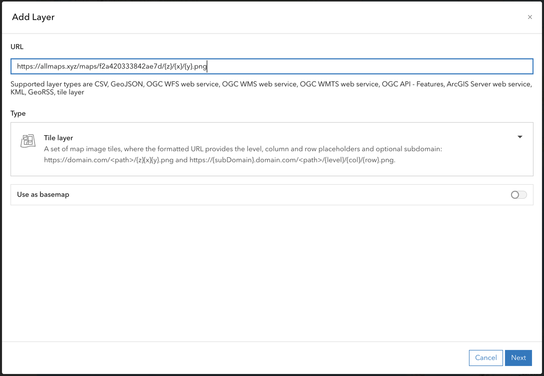

5. Click **Next**
6. Give your layer a **Title** and **Attribution**

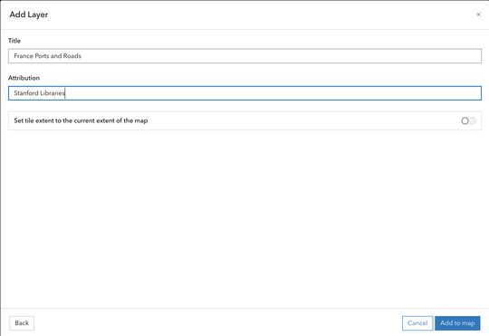

6. Click **Add to map**.
7. Save your map as `France Roads and Ports Digitization (SUNetID)`
   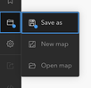
   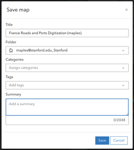

---

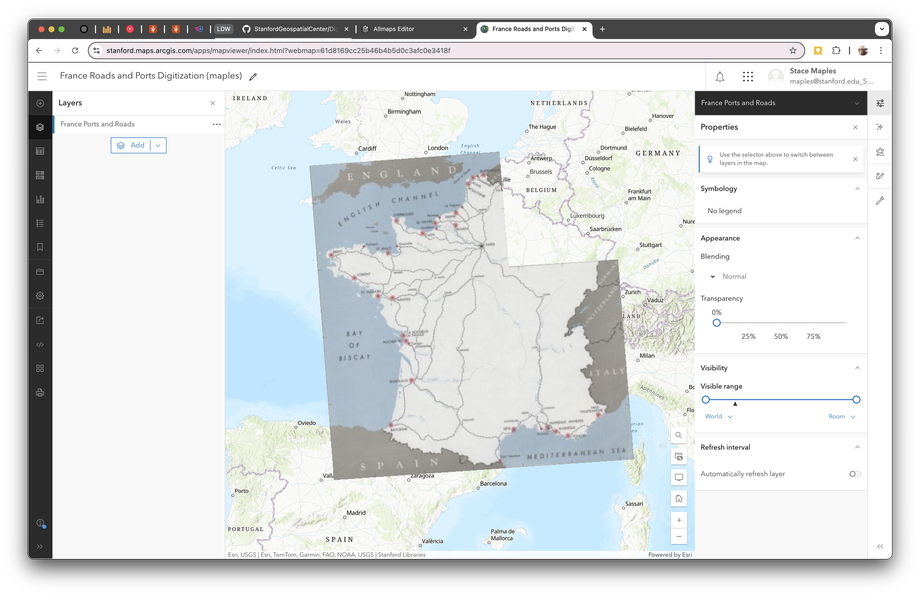

## **Step 6: Add the Feature Layer for Digitization**

1. Click **Add** → **Browse Layers**.
2. Select **My Content** and find **french_ports_railroad_[SUNetID]s**.

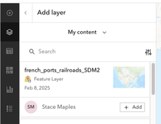

3. Click **+Add**.
4. Click the 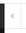Arrow at the top of the panel to close it

---

## **Step 7: Configure Symbology**

#### **What is Symbology?**

**Symbology** refers to the visual appearance of features on your map—colors, sizes, line styles, etc. **Unique symbols** means each category of a feature (like "Major Port" vs. "Minor Port") gets a different appearance, making them visually distinct. This helps you and others see patterns at a glance. When digitizing, use contrasting colors so you can easily see what you've completed versus what remains.

1. Click on the small arrow next to the **french_ports_railroads** layer to expand it.
2. Select the **Ports** layer
3. Select **Edit layer style** in the resulting Properties Panel, on the right.
4. Click on **+Field** and check the box next to `Port Type`

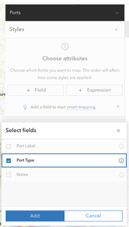

5. Click **Add**
6. In the **Pick a style** dialog, click on **Style options** for the **Types (unique symbols)**

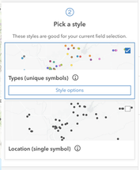

7. Configure symbology for:
   - **Ports**: Use unique symbols based on `port_type` (e.g., 10pt green circle for major ports, 6pt blue circle for minor ports). You want to use a color scheme that contrasts with the features in the map you are digitizing, so that you can easily see your progress. You can change the symbology for your final map later, but for now you want something visible.

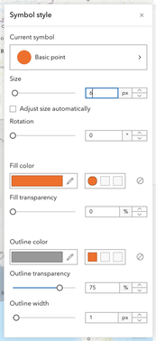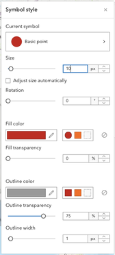

8. Click **Done** and **Done** to save the changes and dismiss the Properties panel.
9. Return to the Layers Panel on the left and configure the symbology for the `Railroads` feature layer

   - **Railroads**: Use a dashed line for railroads.
10. Save your configuration.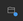

---

## **Step 8: Configure Popups**

#### **What are Popups?**

**Popups** are small information windows that appear when you click on a feature in your map. They display the attributes (data fields) associated with that feature. By configuring which fields appear in popups, you control what information users see when they interact with your map.

1. Click on the **Port** feature layer to open the Properties panel.
2. Click on the **Pop-ups** button.
3. Expand the **Fields list** and confirm the following fields:
   - `port_label`
   - `port_type`
   - `notes`
4. **Drag and Drop** the Fields to rearrange them, if needed.

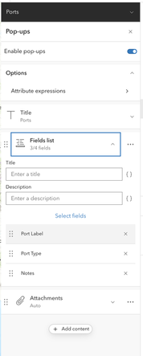

5. Click on the **Railroads** feature layer and confirm the following fields:
   - `railroad_label`
   - `Notes`
6. Click on the **X** to remove the `Shape_Length` field from the pop-up
7. **Save** the changes to your Map.

---

## **Step 9: Create an Interactive Editing App**

#### **What is an Instant App?**

An **Instant App** is a prebuilt web application template from Esri (the company behind ArcGIS) that you can customize without coding. It lets you access and edit your map data from any web browser, without needing to purchase expensive GIS software.

1. Click **Create app** → **Instant Apps**.

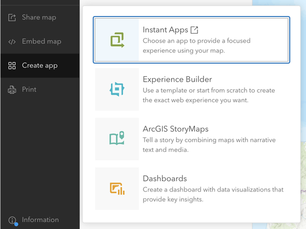

2. Click on **Choose** on the **Sidebar App Template**.

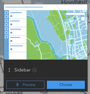

3. Fill out the **Create app - Sidebar** dialog and click **Create app**.

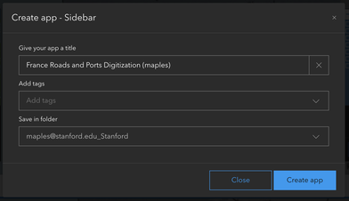

4. Configure the app:
   - Click on the **Search settings** button and use `edit` as the search term.
   - Click on **Edit tools** and click **Continue** to exit Express Mode and continue configuring your app.
   - Toggle **on** **Edit tools** for adding and modifying features.
   - Expand the **french_ports_railroads_SUNetID** layer and check the boxes for `Railroads` and `Ports`.
   - Configure the attribute editor to use dropdown menus for `port_type`.

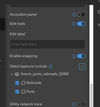

5. Click **Publish** and **Confirm** to save and publish the app.

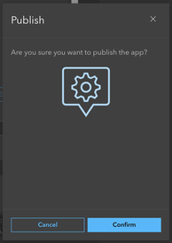

---

## **Step 10: Digitize Your Features**

#### **What is Digitizing?**

**Digitizing** is the process of converting features from a map image into structured geospatial data your computer can understand. When you click on a port location, you're creating a point feature with defined coordinates. When you trace a railroad line, you're creating a line feature. Each feature gets associated attributes (like "port_label" or "port_type") that describe it.

1. Click the **Launch** button to open your app.

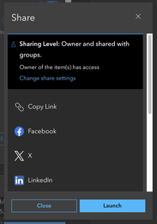

2. Click on the **Edit** button to open the **Editor Tool Panel**.
3. Select the **Ports** template icon and place it on one of the ports in your map.
4. Add the **Port Label** (what is the port called?).
5. Use the **Port Type** dropdown to select either `Major` or `Minor`.
6. Click **Create** to save the feature.
7. Continue digitizing the ports until you have completed the task (or practice for a bit).
8. Click the **Back arrow** to return to the Editor Tools main panel.

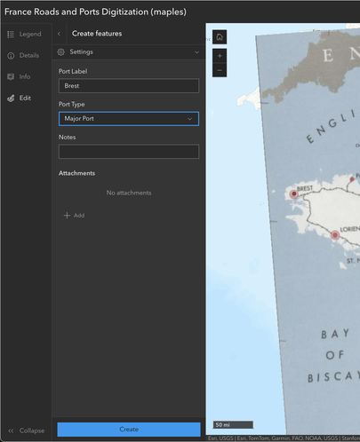

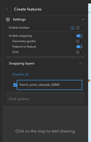
------------------------------------------------------------

## **Step 11: Export Digitized Data to GeoJSON**

#### **What is GeoJSON?**

**GeoJSON** is a standardized text format for storing geospatial data that any GIS software can read. It's based on JSON (JavaScript Object Notation), a universal data format used across the internet. When you export to GeoJSON, your digitized features (ports and railroads) are converted into a file that you can download, edit in other GIS software like QGIS, or share with collaborators.

#### **What is a Hosted Feature Layer?**

A **hosted feature layer** is a dataset stored on ArcGIS Online's cloud servers. Unlike shapefiles or databases stored on your computer, hosted feature layers are always accessible from anywhere via the web, anyone you share them with can access them, and you can easily track edits and versions. When you export to GeoJSON, you're downloading a copy of this data in a portable format.

1. Open https://stanford.maps.arcgis.com in your browser and navigate to **Content** to find the **french_ports_railroads** layer.
2. Find your **french_ports_railroads_SUNetID** Feature Layer (hosted), and click on it to navigate to the Details page for the data.

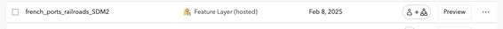

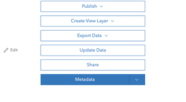

3. Click **Export Data** → **GeoJSON**.

4. Fill out the **Export to GeoJSON** dialog and click **Export**.

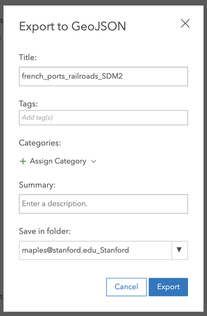

5. On the resulting Details page, click on the **Share** button, change access to `Public`, and click **Save**.
   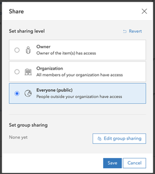
6. Download the exported file for use in other GIS applications.

---

## **Conclusion**

By the end of this exercise, you will have digitized the **major and minor ports** and **railroads** from the historical map and exported your work as geospatial data. Your data will be standardized, exportable, and ready for analysis or integration into other projects.

🚀 **Happy Mapping!**
