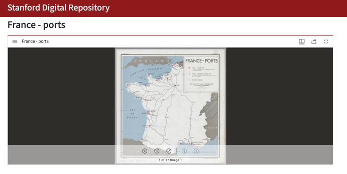

# **Workshop Tutorial: Digitizing French Ports and Railroads in ArcGIS Online**

## **Introduction**
This tutorial will guide you through creating an **ArcGIS Online** application for digitizing **ports** and **railroads** using a historical map of French ports and railroads. The goal is to convert key features from the map into geospatial data.

### **About the XYZ Tiles**
The map used for this digitization task is accessible as an **XYZ tile layer** via a **IIIF manifest**. This setup enables viewing and digitizing the historical map within ArcGIS Online.

- **IIIF Manifest URL**:  
  `https://purl.stanford.edu/zc368qw3281/iiif/manifest`
  
- **Viewer Link**:  
  [Stanford Digital Repository Viewer](https://purl.stanford.edu/zc368qw3281)

- **Allmaps.org Link**
- https://editor.allmaps.org/#/collection?url=https%3A%2F%2Fpurl.stanford.edu%2Fzc368qw3281%2Fiiif%2Fmanifest&image=d95dc4e2f0f60fb8

---

## **Step 1: Login to ArcGIS Online**
1. Open a web browser and navigate to [Stanford's ArcGIS Online Org](https://stanford.maps.arcgis.com):  https://stanford.maps.arcgis.com  
   
2. Click **Sign In**.

3. Click the blue **Stanford University** button

3. You should be bounced to Stanford's SIngle SIgn-On (SSO). Use your Stanford SUNetID and Password to login

---

## **Step 2: Create a New Feature Dataset**
1. Click **Content** in the top menu.
2. Select **New Item** → **Feature Layer** → **Define Your Own Layer**.

3. Under "Specify name and type" Add **Lines and Points** as the geometry type and name the layers `Ports` and `Railroads`

1. Click **Next**, and name the dataset **french_ports_railroads_[your initials or SUNetID]** 

2. Click **Save**.

---

## **Step 3: Customize the Data Schema**

At this point, you should be redirected to the **Details Page** for the **french_ports_railrods_SUNetID** Layer.

### **Fields**
Define the following fields for the dataset:

| Field Name       | Data Type | Length | Description                              |
|------------------|-----------|--------|------------------------------------------|
| `port_label`     | Text      | 50     | Name or identifier for the port.         |
| `port_type`      | Text      | 50     | Classification of the port (major/minor).|
| `railroad_label` | Text      | 50     | Name or identifier for the railroad.     |
| `notes`          | Text      | 255    | Additional observations or comments.     |

---

## **Step 4: Create Controlled Vocabulary Lists**
To standardize the input for `port_type`, create a domain for controlled vocabulary:

1. Go to the **Data** tab in the feature layer settings.
2. Under **Domains**, create the following:
   - **Port Type**: Add the values:
     - **Major**
     - **Minor**
3. Assign this domain to the `port_type` field.

---

## **Step 5: Create an Editing Group**
1. In the **Groups** section, click **Create Group**.
2. Name the group **"French Ports and Railroads Editors"**.
3. Set group visibility to **Organization** or **Public**.
4. Enable **Allow group members to update all items**.
5. Add participants to the group.

---

## **Step 6: Create a Map**
1. Click **Map** in the ArcGIS Online menu.
2. Click **Add** → **Add Layer from Web**.
3. Select **Tile Layer** and paste the **XYZ tile URL** generated from the IIIF manifest.
4. Click **Add Layer**.

---

## **Step 7: Add the Feature Layer for Digitization**
1. Click **Add** → **Search for Layers**.
2. Select **My Content** and find **french_ports_railroads**.
3. Click **Add to Map**.

---

## **Step 8: Configure Symbology**
1. Click on the **french_ports_railroads** layer.
2. Select **Change Style**.
3. Configure symbology for:
   - **Ports**: Use unique symbols based on `port_type` (e.g., red circle for major ports, orange circle for minor ports).
   - **Railroads**: Use a dashed line for railroads.
4. Save your configuration.

---

## **Step 9: Configure Popups**
1. Click on the **french_ports_railroads** layer.
2. Select **Configure Pop-ups**.
3. Display the following fields:
   - `port_label`
   - `port_type`
   - `railroad_label`
   - `notes`
4. Save the changes.

---

## **Step 10: Share the Map Using an Editing App**
1. Click **Share** → **Create Web App**.
2. Select the **Editor App Template**.
3. Configure the app:
   - Enable **Editing** for adding and modifying features.
   - Configure the attribute editor to use dropdown menus for `port_type`.
4. Save and publish the app.

---

## **Step 11: Export Digitized Data to GeoJSON**
1. Go to **Content** and find the **french_ports_railroads** layer.
2. Click **Export** → **GeoJSON**.
3. Download the exported file for use in other GIS applications.

---

## **Conclusion**
By the end of this exercise, participants will have digitized the **major and minor ports** and **railroads** from the historical map. The resulting data will be standardized, exportable, and ready for analysis or integration into other projects. 

🚀 **Happy Mapping!**